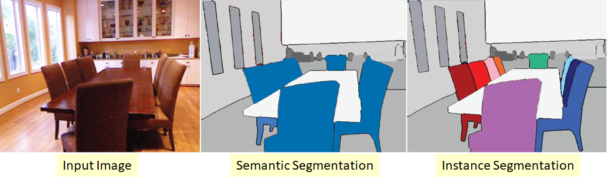
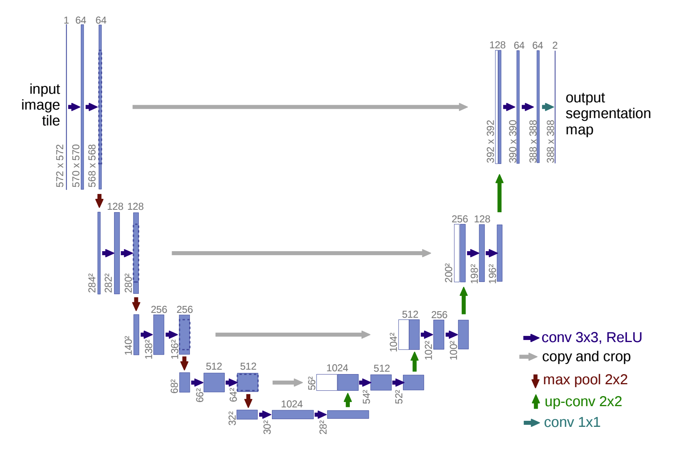
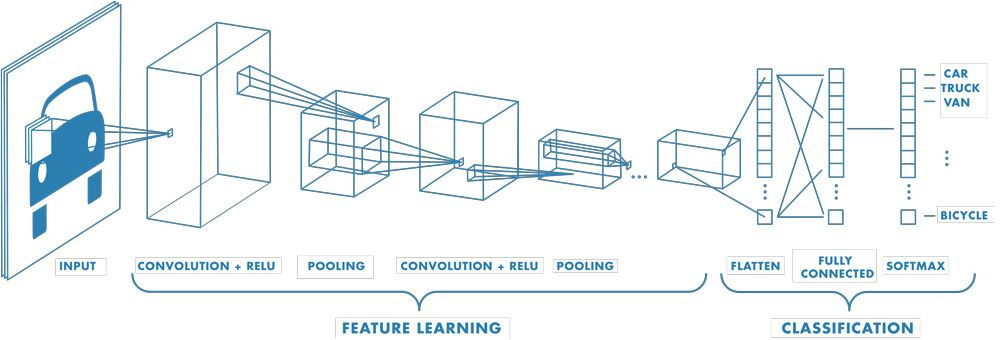
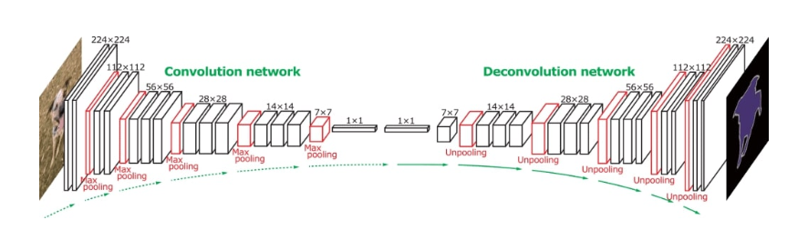
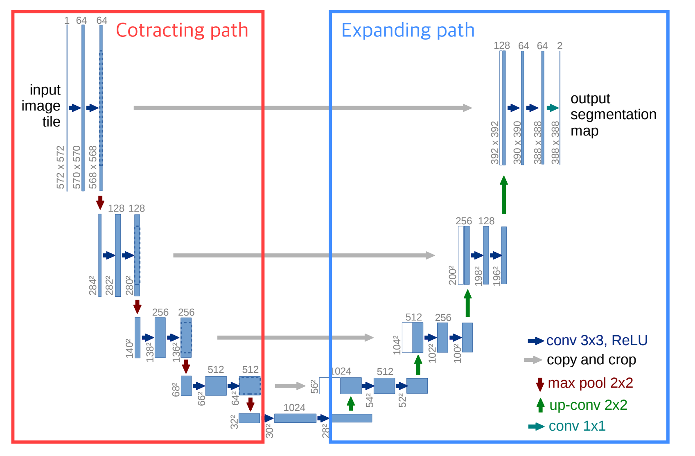
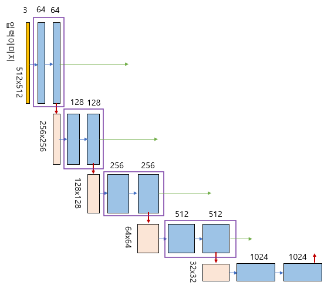
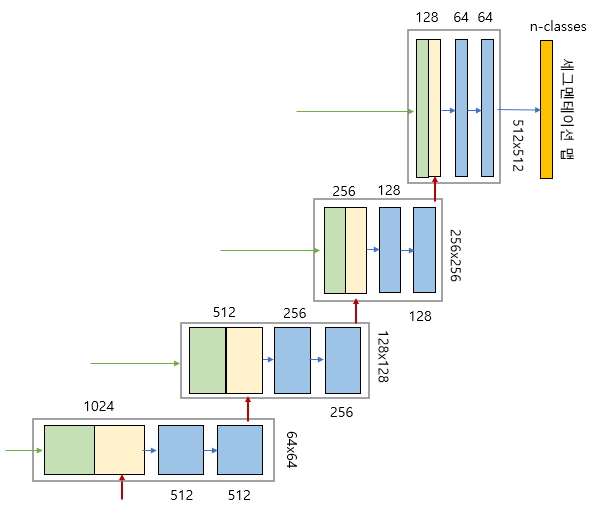
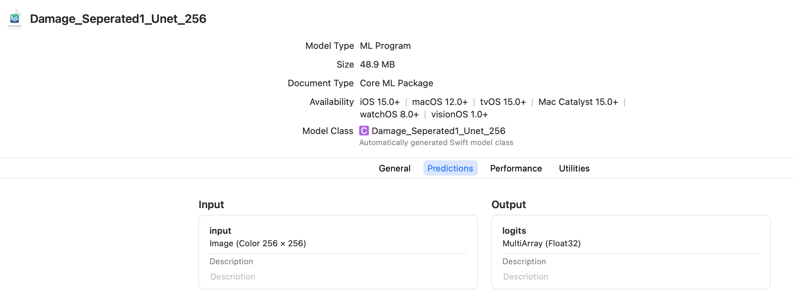

+++
title = "U-Net 모델에 관하여" ## 제목 입력
date = "2025-08-31T23:30:30+09:00" ## 작성일시 입력. 연연연연-월월-일일T시시:분분:초초+09:00 형식
##dateFormat = "2006-01-02"
author = "Root" ## 작성자 입력
authorTwitter = ""
cover = ""
tags = ["1주차, "U-Net", "차량파손모델", "ImageSegmentation"] ## 태그 입력
keywords = [""] ## 키워드 입력. 없으면 쓰지 말기
description = "" ## 설명 입력
showFullContent = false
readingTime = false
hideComments = false
+++


## U-Net 모델이란?

- 논문 : https://arxiv.org/abs/1505.04597

## 이미지 처리 방식의 종류

#### Classification

- 입력으로 주어진 이미지 안의 객체의 종류를 구분
- MNIST 데이터 셋의 경우, 0부터 9까지 총 10가지의 숫자를 각각의 Class로 구분

#### Localization

- 입력으로 주어진 이미지 안의 객체가 이미지 안의 어느 위치에 존재하는지 위치정보를 판단
- 주로 Bounding Box를 사용

#### Object Detection

- Classification + Localization
- 이미지 안의 객체 위치와 객체의 종류를 동시에 출력

#### Segmentation

- 픽실 단위로 한 Classification
    - 주어진 이미지 내에서 각 픽셀이 어떤 클래스에 속하는지 분류
- 각 픽셀로 분류된 클래스는 모델이 만든 결과물인 마스크에 픽셀 단위로 기록
    - 특정 픽셀이 어떤 클래스에도 해당하지 않은 경우, 0으로 표기

###### Semantic Segmentation

- 분할의 기본 단위를 클래스로 설정
- 만일 두개 이상의 사물이 동일한 클래스에 해당한다면 이들은 서로 같은 예측 마스크값

###### Instance Segmentation

- 분할의 기본 단위를 사물로 설정
- 만일 두개 이상의 사물이 동일한 클래스에 해당하더라고, 서로 다른 사물이란 서로 다른 예측 마스크값



## U-Net 모델과 구조

#### U-Net이란?

- Semantic Segmentation 수행을 위해 널리 쓰이는 모델 중 하나
- 네트워크 형태가 알파넷 U와 비슷하다고 하여 붙여진 이름, 의생명공학 이미지 Segmentation을 위해 개발됨
    
    
    
- FCN 과 같은 이미지 분할 모델
    - 인코더-디코더 아키텍쳐로서, 이름에서 알 수 있듯 모델의 구조가 U 자 형으로 대칭적인 구조로 인코더 디코더가 서로 연관
    - FCN 모델의 핵심은 Conv 레이어의 결과물을 Flatten 하여 공간적 정보를 망가뜨리지 않고 Deconv 를 하여 픽셀 단위 분석을 수행하는 것
    U-Net 역시 Conv -> Deconv 의 구조
- 여기서 잠깐, FCN(Fully Convolutional Network)이란?
    - 전통적인 CNN 신경망을 활용한 모델의 구조
    
    
    
    - Convolution 연산을 통해 다차원 공간 범위를 한번에 탐지해 나가며 Feature map 을 출력하다가,
    최종 Feature map 을 벡터 형태로 펼치고(Flatten),
    그 펼친 값을 Fully Connected Layer 에 입력 ⇒ 결론
    - 이미지 분류 문제는 잘 해결되지만, Flatten 시점부터 이미지의 구조적 특성이 사라지게됨 → Image Segmentation 문제는 해결 불가능
    - 이러한 문제를 해결하기 위해 → Fully Convolutional Networks 는 이름 그대로 모든 레이어를 Convolution Network 를 사용하는 방식을 사용
        - Flatten 을 이용하여 억지로 공간 정보를 파괴하는 부분을 제거하고, 압축된 Latent Vector 를 만드는 부분까지 전부 CNN 으로 유지
            
            
            
        - Deconv 레이어는 Conv 레이어의 정반대 기능을 수행
- skip connection
    - Conv 블록에서 나온 feature map을 가져다 → Decoder(Deconv/Upsampling) 단계와 합치는 과정
    - U-Net 에서는 동 위치에 있는 인코더 디코더 상호간 전부 연결하는 방식으로 위와 같이 U 자형 구조를 만듬
    - Encoder의 각 단계에서 나온 feature map을 Decoder의 대응되는 단계와 연결
    - 방법은 단순히 concat
    - 코더의 동일한 크기인 피쳐 맵을 이어붙여주는 역할
        - 위치가 대응(픽셀 좌표가 1:1로 대응)
        - Decoder의 특정 단계 feature map 크기 = Encoder의 대응 단계 feature map 크기

#### 장점

- 기존 Segmentation 모델의 문제점 해결
    - 빠른 속도
        - 기존 Segmentation 모델의 단점이엇던 느린 연산 속도 개선
    - Context와 Localization의 늪에서 탈출
        - Segmentation Network는 클래스 분류를 위한 인접 문맥 파악(Context)과 객체의 위치 판단(Localization)을 동시에 수행.
        이 둘은 Trade-Off의 관계
        - U-Net은 다층의 Layer의 Output을 동시에 검증해서 이러한 Trade-Off를 극복합니다.

#### U-Net with EfficientNet

- U-Net의 구조는 알파벳 U의 왼쪽 절반에 해당하는 Contracting Path와 오른쪽 절반에 해당하는 Expanding Path의 2가지 Path로 분리할 수 있다



###### Contracting Path



- Encoder 역할을 수행하는 부분 → Convolution 네트워크 구성
- 입력을 Feature Map으로 변형해 이미지의 Context 파악

###### Expanding Path



- Decoder 역할을 수행하는 부분 → 전형적인 Upsampling + Convolution 네트워크 구성
- 즉, Convolution 연산을 거치기 전 Contracting Path에서 줄어든 사이즈를 다시 복원하는(Upsampling) 형태
- Expanding Path에서는 Contracting을 통해 얻은 Feature Map을 Upsampling하고, 각 Expanding 단계에 대응되는 Contracting 단계에서의 Feature Map과 결합해서(Skip-Connection Concatenate) 더 정확한 Localization을 수행

## U-Net기반 모델을 CoreMLTools로 변환하기

```python
import torch, coremltools as ct
from pathlib import Path
from src.Models import Unet

## ckpt = "./models/[DAMAGE][Scratch_0]Unet.pt"
## ckpt = "./models/[DAMAGE][Seperated_1]Unet.pt"
## ckpt = "./models/[DAMAGE][Crushed_2]Unet.pt"
ckpt = "./models/[DAMAGE][Breakage_3]Unet.pt"
num_classes = 2
H, W = 256, 256

## 1) 모델 만들고 가중치 로드
model = Unet(encoder="resnet34", pre_weight="imagenet", num_classes=num_classes)
state = torch.load(ckpt, map_location="cpu")

## 다양한 저장 포맷 대응(필요시 키 정리)
if isinstance(state, dict) and "state_dict" in state: state = state["state_dict"]
clean = {k.replace("module.","").replace("model.",""): v for k,v in state.items()}
model.model.load_state_dict(clean, strict=False)
model.eval()

## 2) TorchScript
dummy = torch.randn(1,3,H,W)
with torch.no_grad():
    scripted = torch.jit.trace(model, dummy)
    scripted = torch.jit.freeze(scripted)

## 3) Core ML 변환 (입력: RGB 이미지, /255 스케일)
try:
    mlmodel = ct.convert(
        scripted,
        inputs=[ct.ImageType(name="input", shape=(1,3,H,W), color_layout="RGB", scale=1/255.0)],
        outputs=[ct.TensorType(name="logits")],
        compute_units=ct.ComputeUnit.ALL,
        compute_precision=ct.precision.FLOAT16,
        minimum_deployment_target=ct.target.iOS15,
        convert_to="mlprogram",
    )
except ValueError as e:
    print(f"[WARN] ML Program conversion with FP16 failed ({e}). Retrying with NeuralNetwork backend (no precision override)...")
    ## Fallback: NeuralNetwork backend (older iOS). Remove compute_precision.
    mlmodel = ct.convert(
        scripted,
        inputs=[ct.ImageType(name="input", shape=(1,3,H,W), color_layout="RGB", scale=1/255.0)],
        outputs=[ct.TensorType(name="logits")],
        compute_units=ct.ComputeUnit.ALL,
    )

## out_path = Path("Damage_Scratch0_Unet_256.mlmodel")
## out_path = Path("Damage_Seperated1_Unet_256.mlmodel")
## out_path = Path("Damage_Crushed2_Unet_256.mlmodel")
out_path = Path("Damage_Breakage3_Unet_256.mlmodel")
try:
    spec = mlmodel.get_spec()
    is_mlprogram = spec.WhichOneof("Type") == "mlProgram"
except Exception:
    ## Fallback: if convert_to was set to mlprogram, assume package
    is_mlprogram = False
if is_mlprogram and out_path.suffix != ".mlpackage":
    out_path = out_path.with_suffix(".mlpackage")

mlmodel.save(str(out_path))
print(f"Saved: {out_path}")
```

### 결과
