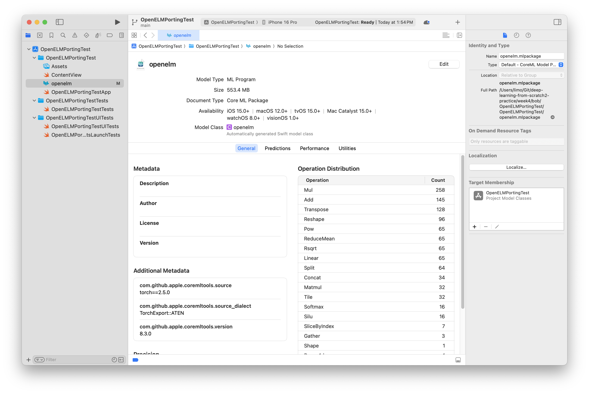

+++
title = "CoreML Tools로 Pytorch 모델 변환해보기"
date = "2025-08-13T15:21:43+09:00"
#dateFormat = "2006-01-02" # This value can be configured for per-post date formatting
author = "Bob"
authorTwitter = "" #do not include @
cover = ""
tags = ["첫 포스트", "Core ML Tools"]
keywords = ["", ""]
description = ""
showFullContent = false
readingTime = false
hideComments = false
+++

## Core ML Tools에 대해

https://apple.github.io/coremltools/docs-guides/source/overview-coremltools.html

- 파이토치, 텐서플로우, 사이킷런 등 (애플 입장에서) 써드 파티 머신러닝 프레임워크로 학습된 모델의 가중치를 mlpackage 파일로 변환해 CoreML에서 사용할 수 있도록 한다
    
    <aside>
    
    - Convert trained models from libraries and frameworks such as [TensorFlow](https://www.tensorflow.org/) and [PyTorch](https://pytorch.org/) to the Core ML model package format.
    - Read, write, and optimize Core ML models to use less storage space, reduce power consumption, and reduce latency during inference.
    - Verify creation and conversion by making predictions using Core ML in macOS.
    </aside>
    
- 여러 포맷의 모델에 대한 unified representation
- 온디바이스 서빙
- 지원 프레임워크 및 버전 (2025-06-29 현재)
    
    
    | Model Family | Supported Packages |
    | --- | --- |
    | Neural Networks | [TensorFlow 1 (1.14.0+)](https://www.tensorflow.org/versions/r1.15/api_docs/python/tf), [TensorFlow 2 (2.1.0+)](https://www.tensorflow.org/), [PyTorch (1.13.0+)](https://pytorch.org/) |
    | Tree Ensembles | [XGboost (1.1.0)](https://xgboost.readthedocs.io/en/latest/index.html), [scikit-learn (0.18.1)](https://scikit-learn.org/stable/) |
    | Generalized Linear Models | [scikit-learn (0.18.1)](https://scikit-learn.org/stable/) |
    | Support Vector Machines | [LIBSVM (3.22)](https://pypi.org/project/libsvm/), [scikit-learn (0.18.1)](https://scikit-learn.org/stable/) |
    | Pipelines (pre- and post-processing) | [scikit-learn (0.18.1)](https://scikit-learn.org/stable/) |

## 파이토치 → Core ML 변환 워크플로우

https://apple.github.io/coremltools/docs-guides/source/convert-pytorch-workflow.html

1. Capture the PyTorch model graph from the original torch.nn.Module, via [**`torch.jit.trace`**](https://pytorch.org/docs/stable/generated/torch.jit.trace.html) or [**`torch.export.export`**](https://pytorch.org/docs/stable/export.html#torch.export.export).
2. Convert the PyTorch model graph to Core ML, via the Core ML Tools [Unified Conversion API](https://apple.github.io/coremltools/docs-guides/source/unified-conversion-api.html).

- 파이토치 모델 그래프를 캡쳐하는 방법은 두 가지가 있다
1. TorchScript - 파이토치 모델의 중간 표현. 원래 있었음. [**`torch.jit.trace`](https://pytorch.org/docs/stable/generated/torch.jit.trace.html) 활용**
2. ExportedDiagram - 역시 중간 단계 표현. 파이토치 2부터 도입됨. [**`torch.export.export`**](https://pytorch.org/docs/stable/export.html#torch.export.export) 활용

## 파이토치 모델 변환 해보기

https://apple.github.io/coremltools/docs-guides/source/convert-openelm.html#converting-an-open-efficient-language-model

- 파이토치로 학습된 모델이 필요하다
- 루트, 이사가 파이토치 모델을 넘겨 주기 전에 공개된 모델인 [OpenELM](https://arxiv.org/abs/2404.14619)을 Core ML Tools로 변환해보자

```python
import torch
import numpy as np
import coremltools as ct
from transformers import AutoModelForCausalLM, AutoTokenizer

torch_model = AutoModelForCausalLM.from_pretrained(
    "apple/OpenELM-270M-Instruct",
    torch_dtype=torch.float32,
    trust_remote_code=True,
    return_dict=False,
    use_cache=False,
)
torch_model.eval()
for module in torch_model.modules():
    module.eval()

# Export
example_input_ids = torch.zeros((1, 32), dtype=torch.int32)
sequence_length = torch.export.Dim(name="sequence_length", min=1, max=128)
dynamic_shapes = {"input_ids": {1: sequence_length}}
exported_program = torch.export.export(
    torch_model,
    (example_input_ids,),
    dynamic_shapes=dynamic_shapes,
)

mlmodel = ct.convert(exported_program)
mlmodel.save("openelm.mlpackage")

```



Xcode로 열면 모델에 대한 정보가 보인다

이제 남은 것

- 토크나이저
- 변환한 모델로 추론

## 인코딩

- 데모 코드를 보면 Llama-2 토크나이저를 사용한다
    
    ```swift
    tokenizer = AutoTokenizer.from_pretrained("meta-llama/Llama-2-7b-hf")
    ```
    
- 모델에 넣기 전에 토큰화를 하려면 이 역시 iOS에서 swift를 통해 부를 수 있는 인터페이스가 필요하다
- 다행히 이런게 있었다 - https://github.com/huggingface/swift-transformers/tree/main
- 이렇게 토큰화를 할 수 있다
    
    ```swift
    let tokenizer = try! await AutoTokenizer.from(pretrained: "meta-llama/Llama-2-7b-hf", hubApi: .init(hfToken: "hf_"))
    let encoded = tokenizer.encode(text: "Describe the Swift programming language.")
    print(encoded)
    let decoded = tokenizer.decode(tokens: encoded)
    print(decoded)
    ```
    
    ```
    [1, 20355, 915, 278, 14156, 8720, 4086, 29889]
    
    <s> Describe the Swift programming language.
    ```
    

## 디코딩

- ChatGPT 힌트
    
    Core ML로 실행한 출력이 `Float32 (1 × 8 × 32000)` 형태라면 이는 **[batch_size, sequence_length, vocab_size]**, 즉 시퀀스 내 각 토큰 위치에서의 **vocab logits**을 의미합니다. 디코딩하려면:
    
    1. 각 시점마다 argmax로 vocab index를 선택
    2. 해당 index를 토크나이저로 디코딩 (SentencePiece 등)

- 완성 코드
    
    ```swift
    
    //
    //  OpenELMModel.swift
    //  OpenELMPortingTest
    //
    //  Created by 임영택 on 6/29/25.
    //
    
    import Foundation
    import SwiftUI
    import Tokenizers
    import CoreML
    
    class OpenELMModel: ObservableObject {
        private var tokenizer: Tokenizer?
        private let model = try! OpenELM(configuration: .init())
        
        @Published var generatedText = ""
        
        func loadTokenizer() async throws {
            tokenizer = try! await AutoTokenizer.from(pretrained: "meta-llama/Llama-2-7b-hf", hubApi: .init(hfToken: Configs.hfToken, useOfflineMode: false))
        }
        
        func encode(_ tokens: [Int]) throws -> OpenELMInput {
            let modelInput = try! MLMultiArray(shape: [1, NSNumber(value: tokens.count)], dataType: .int32)
            tokens.enumerated().forEach { (i, val) in
                modelInput[[0, NSNumber(value: i)]] = NSNumber(value: val)
            }
            return OpenELMInput(input_ids: modelInput)
        }
        
        func encodeText(_ input: String) throws -> [Int] {
            guard let tokenizer else {
                throw NSError(domain: "Tokenizer not loaded", code: 1)
            }
            return tokenizer.encode(text: input)
        }
        
        func decode(_ output: OpenELMOutput) throws -> Int {
            let nextTokenId = getNextTokenId(from: output.slice_180)
            return nextTokenId
        }
        
        func decodeTokens(_ tokens: [Int]) throws -> String {
            guard let tokenizer else {
                throw NSError(domain: "Tokenizer not loaded", code: 1)
            }
            return tokenizer.decode(tokens: tokens)
        }
        
        func getNextTokenId(from logits: MLMultiArray) -> Int {
            let shape = logits.shape.map { $0.intValue } // → [batch, sequence, vocab]
            
            guard shape.count == 3 else {
                fatalError("Unexpected shape for logits: \(shape)")
            }
            
            let sequenceLength = shape[1] // 현재 시퀀스 길이
            let vocabSize = shape[2]      // 어휘 크기 (예: 32000)
            
            // 파이썬의 [:, -1:] 부분 - 마지막 시퀀스 위치만 사용
            let lastSequenceIndex = sequenceLength - 1
            
            var maxLogit: Float = -Float.greatestFiniteMagnitude
            var maxTokenId: Int = 0
            
            // 파이썬의 np.argmax(logits, -1) 부분 - vocab 차원에서 최대값 찾기
            for vocabIndex in 0..<vocabSize {
                let logit = logits[[
                    NSNumber(value: 0),                    // batch index (항상 0)
                    NSNumber(value: lastSequenceIndex),    // 마지막 sequence position
                    NSNumber(value: vocabIndex)            // vocab index
                ]].floatValue
                
                if logit > maxLogit {
                    maxLogit = logit
                    maxTokenId = vocabIndex
                }
            }
            
            return maxTokenId // 다음 토큰 ID 1개만 반환
        }
        
        @MainActor
        func generateText(_ prompt: String, maxSequenceLength: Int = Configs.maxSequenceLength) async throws -> String {
            guard let tokenizer else {
                throw NSError(domain: "Tokenizer not loaded", code: 1)
            }
            
            generatedText = ""
            
            // 초기 토큰화
            var inputIds = try encodeText(prompt)
            print("Initial tokens: \(inputIds)")
            print("Initial text: \(try decodeTokens(inputIds))")
            
            // 파이썬의 for i in range(max_sequence_length) 구현
            for i in 0..<maxSequenceLength {
                print("Generation step \(i + 1)/\(maxSequenceLength)")
                
                do {
                    // 현재 토큰들로 모델 입력 생성
                    let modelInput = try encode(inputIds)
                    
                    // 모델 추론 실행
                    let modelOutput = try await model.prediction(input: modelInput)
                    
                    // 다음 토큰 결정 (파이썬의 np.argmax(logits, -1)[:, -1:])
                    let nextToken = try decode(modelOutput)
                    print("Next token: \(nextToken)")
                    
                    // 새 토큰을 시퀀스에 추가 (파이썬의 np.concat)
                    inputIds.append(nextToken)
                    
                    // 현재까지 생성된 텍스트 디코딩
                    let currentText = try decodeTokens(inputIds)
                    generatedText = currentText
                    print("Current text: \(currentText)")
                    
                    // 종료 조건 확인 (EOS 토큰이나 특별한 토큰)
                    if nextToken == tokenizer.eosTokenId {
                        print("Found end token, stopping generation")
                        break
                    }
                    
                } catch {
                    print("Error during generation step \(i): \(error)")
                    break
                }
            }
            
            // 최종 텍스트 반환
            let finalText = try decodeTokens(inputIds)
            print("Final generated text: \(finalText)")
            return finalText
        }
    }
    
    ```
